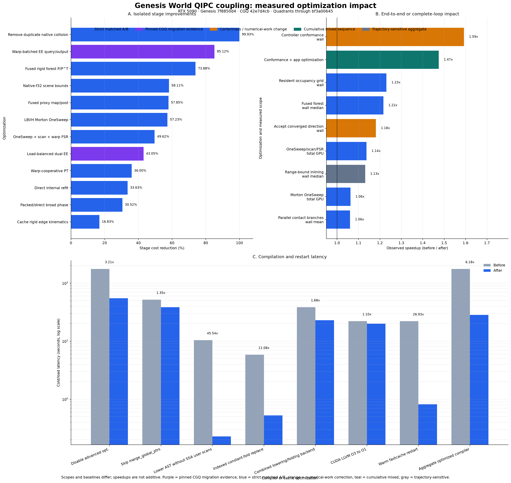

# Genesis World QIPC Coupling Performance Optimization Report

Date: 2026-09-30  
Hardware: NVIDIA GeForce RTX 5090  
Genesis snapshot: `7f8850d4`  
CGQ ground truth: `42e7d4cbbad08739107ad830a17918f5f0f209ff`  
Quadrants performance snapshots: `e5811c2dd`, `3b0f9c2ad`, `12119f03e`,
`bf3a00645`

This report consolidates the performance work completed while faithfully
migrating the CGQ cloth, IPC contact, reduced-KKT, and GPU graph pipeline into
Genesis World. It covers the new coupling framework and the directly supporting
Quadrants changes; it does not claim to summarize unrelated optimizations in the
upstream Genesis rigid solver.



## Executive conclusions

- The initial diagnostic Franka-cloth investigation measured a `4.529x`
  Genesis / CGQ median wall-time ratio (`64.832 ms` versus `14.314 ms`).
  Newton/PCG work was not yet aligned, so this is not an equal-work baseline.
  It identified rigid-forest graph fragmentation, duplicated work, generic
  sort/reduce, excessive dynamic-range launches, and numerical-work mismatches;
  BCOO SpMV was not a leading cause.
- The completed Genesis conformance and application-side optimization sequence
  reduced the representative strict Franka-cloth median from `43.009 ms` to
  `29.165 ms`, a `1.475x` speedup. That endpoint still contained compiler-owned
  launch overhead.
- Quadrants resident-grid selection then reduced a matched Genesis window from
  `24.888 ms` to `20.230 ms` (`1.230x`) while preserving exactly 646 PCG
  iterations and 18 Newton evaluations.
- Quadrants dynamic-range bound inlining removed five scalar helper kernels per
  PCG iteration. On the 200-frame cloth stack, the raw Genesis median changed
  from `27.071 ms` to `23.933 ms` (`1.131x`); the resulting raw Genesis / CGQ
  ratio was `1.007x`, and the coarse wall-per-PCG-work ratio was `1.040x`.
- Four additional 250-frame cloth workloads put the interpretable
  Genesis / CGQ wall-per-work ratios at `0.965x`, `0.979x`, and `1.005x`.
  The crossed-sheet stress case gave a coarse `1.037x`, but its trajectories
  diverged and it is not strict equal-work evidence.
- Cold graph compilation improved from an observed `175.64 s` to `28.44 s`
  on the production optimization path and from `54.68 s` to `22.14 s` on the
  development path. These aggregate values span compiler revisions; the
  individual same-revision measurements below identify the causal changes.
- Speedups in this report are not additive. The scopes range from one kernel to
  a complete frame, and some correctness fixes change Newton or PCG work.

## Evidence policy

The report uses four evidence classes:

- **Strict matched A/B**: same scene, same profile window, equivalent numerical
  work or a named fixed-work kernel comparison. These measurements are the
  primary causal evidence.
- **Pinned CGQ migration evidence**: an optimization was already selected by
  CGQ experiments and was faithfully migrated. Genesis retains correctness and
  occupancy proof, while the original CGQ A/B remains the algorithm-selection
  authority.
- **Numerical-work correction**: a correctness or parameter-conformance fix
  removes unnecessary Newton or PCG work. It is a real frame-time improvement,
  but not an implementation-throughput measurement.
- **Trajectory-sensitive aggregate**: graph scheduling or floating-point order
  changes later Krylov work. The direct kernel evidence is causal; the complete
  wall-time change is reported but not attributed wholly to the optimization.

All percentages use `(before - after) / before`. All speedups use
`before / after`. The machine-readable ledger is
`qipc-coupling-performance-data.json`.

The retained repository artifacts include JSON/CSV summaries and the benchmark
scripts, but not every original Nsight SQLite database. Named-kernel figures
whose raw database is absent are preserved in the authoritative performance
ledger and release data; reproducing them requires rerunning the documented
profile window rather than querying the original SQLite capture.

## Runtime acceleration ledger

### Contact algebra and EE traversal

#### Direct rank-1 EE Hessian scatter

- **Change**: ordinary four-vertex EE contact emits a 12-vector, gradient scale,
  and Hessian coefficient, then directly writes ten 3x3 outer-product blocks.
  It no longer materializes a dense 12x12 Hessian. Dense storage remains only
  for mollified and degenerate branches.
- **Measured effect**: stack use fell from 5,088 to 1,600 bytes per thread.
  Pinned-CGQ experiments measured up to `2.8x` isolated-kernel speedup,
  `149 -> 84 us` for the frame-2 EE filter (`1.78x`), and a `5.8%` complete
  step reduction.
- **Evidence class**: pinned CGQ migration evidence.
- **Genesis commit**: foundational contact implementation `28b42c8f`.

#### Warp-batched EE candidate output

- **Change**: subgroup ballot and prefix compaction perform one global output
  reservation per warp batch instead of one reservation per accepted pair.
  Required-size accounting remains exact when the buffer overflows.
- **Measured effect**: the complete warp-per-EE query schedule changed from
  `603 -> 92 us` on frame 2 (`6.5x`) and from `403.8 -> 60.1 us` over the orbit
  mean (`6.7x`).
- **Evidence class**: pinned CGQ migration evidence. The measurement includes
  the complete warp query schedule, not only the reservation instruction.
- **Genesis commit**: `28b42c8f`.

#### Load-balanced dual EE

- **Change**: removed serialized scene-scale traversal. Static level expansion
  feeds persistent warp-local DFS workers; both stages use device-scalar live
  counts, subgroup-compacted output, and exact checkpoint replay on overflow.
- **Measured effect**: pinned CGQ Kimono experiments improved query-only work by
  `1.858x`, build-plus-query by `1.756x`, and node tests by `3.119x` with
  identical leaf tests. Production-auto query improved `1.678x` on Kimono and
  `1.008x` on WreckingBall. The accepted small-scene trade-off was a
  `0.076 ms/query` regression for two bunnies.
- **Evidence class**: pinned CGQ migration evidence; local Genesis validation
  proves candidate parity, overflow replay, and the intended resident launch.
- **Genesis commits**: `28b42c8f`, with heterogeneous metadata correction in
  `4796f223`.

### Point-triangle traversal and BVH representation

#### Warp-cooperative PT traversal

- **Change**: one warp owns each swept-point query, uses a bounded shared
  frontier, grid-strides the dynamic vertex count, and compacts both node pushes
  and emitted pairs at subgroup level.
- **Measured effect**: `151.721 -> 97.109 us/Newton`, or `1.562x` and `36.0%`
  less PT time. The nine-frame capture removed `0.983 ms` from the query stage.
- **Evidence class**: strict named-kernel A/B with identical candidate,
  Newton, PCG, line-search, CCD, and accepted-step sequences.
- **Genesis commit**: `bcda51f4`.

#### Packed conservative DOP14f

- **Change**: fourteen outward-rounded `f32` values occupy one aligned 64-byte
  row instead of a 112-byte `f64` node. A retained `f64` path remains available
  as the explicit correctness and performance oracle.
- **Measured effect**:
  - scene-bound reduction: `48.816 -> 20.448 us/Newton` (`2.387x`);
  - direct internal refit: `132.655 -> 95.662 us/Newton` (`1.387x`);
  - warp PT: `96.751 -> 42.911 us/Newton` (`2.255x`);
  - complete packed/direct named broad phase versus f64/legacy:
    `608.777 -> 422.971 us/Newton` (`1.439x`, 30.5% lower).
- **Evidence class**: strict matched named-stage A/B. Whole-window wall medians
  were noise and are deliberately not used as the layer claim.
- **Genesis commit**: `527ddf9a`.

#### Direct internal refit

- **Change**: the second completed child writes all parent min/max lanes in one
  visit, replacing initialize-parent plus two child-merge phases. Body metadata
  is propagated in the same traversal.
- **Measured effect**: with f64 bounds held fixed,
  `199.870 -> 132.655 us/Newton` (`1.507x`). Packing then supplies the separate
  `1.387x` improvement above.
- **Evidence class**: strict named-stage A/B.
- **Genesis commit**: `527ddf9a`.

### Sorting, scan, and segmented reduction

#### Dynamic OneSweep for LBVH Morton keys

- **Change**: triangle and edge Morton keys use the dynamic u64 OneSweep path
  over the exact device-scalar live range. The former padded generic radix path
  remains only as the explicit A/B oracle.
- **Measured effect**:
  - Morton stages: `16.105 -> 6.888 ms` over nine frames (`2.338x`);
  - generated variants: `288 -> 72`;
  - kernel instances: `5,184 -> 1,296`;
  - total GPU kernel time: `188.504 -> 177.448 ms` (`1.062x`).
- **Evidence class**: strict A/B with unchanged trajectory work.
- **Genesis commit**: `93be3590`.

#### Dynamic OneSweep, exclusive scan, and warp FSR

- **Change**: contact doublets, contact triplets, and global body BCOO use
  CGQ-style dynamic OneSweep, decoupled-lookback exclusive scan, and warp
  head-segmented reduction. All extents remain zero-dimensional device scalars,
  and allocation growth replays the same compiled graph.
- **Measured effect**:
  - sort/reduce stages versus retained fallback:
    `24.881 -> 12.534 ms` (`1.985x`);
  - versus the pre-layer profile: `30.421 -> 12.534 ms` (`2.427x`);
  - variants: `432 -> 131`; instances: `7,776 -> 2,358`;
  - total GPU time: `216.494 -> 190.349 ms` (`1.137x`);
  - 100-frame wall median versus retained fallback:
    `27.019 -> 26.323 ms` (`1.026x`);
  - complete layer versus the earlier `29.165 ms` result:
    `1.108x`.
- **Scale validation**: stable sort, scan, and FSR were tested from zero through
  1M entries; u64 sort was exercised through 100M entries. At 1M entries,
  Genesis sort measured approximately `0.353 ms` versus CGQ `0.254 ms`.
  The 1M-entry Genesis FSR-plus-clear primitive measured approximately
  `0.182 ms` versus CGQ's approximately `0.173 ms` bundle. No separate FSR
  speedup is claimed because the two benchmark stage boundaries differ.
- **Evidence class**: strict stage and GPU A/B; complete wall effects remain
  sensitive to later solver work.
- **Genesis commit**: `ba777cda`.

### Reduced KKT and rigid forest

#### Fused rigid forest projection

- **Change**: CGQ tree layouts and bounded fused paths replace the scan-all
  Genesis P/P-transpose schedule. The original path remains selectable only as
  an explicit performance oracle.
- **Measured effect**:
  - expand/project: `134.0 -> 35.0 us/PCG` (`3.83x`);
  - launches: `26 -> 2` per PCG (`13x` fewer);
  - 100-frame wall median: `65.399 -> 53.783 ms` (`1.216x`, 17.8% lower).
- **Additional solver effect**: restoring the missing actuator velocity term in
  the articulated preconditioner reduced a representative ten-frame
  total-PCG median from `166.5 -> 98` (`1.699x` less Krylov work).
- **Evidence class**: strict normalized stage A/B; the actuator item is a
  numerical/preconditioner correction.
- **Genesis commit**: `910f9f4c`.

#### Fused proxy map and post-processing

- **Change**: tangent expansion is fused with optional slack expansion, while
  proxy wrench restriction is fused with result writeback.
- **Measured effect**:
  - map/post: `34.4 -> 14.5 us/PCG` (`2.37x`);
  - PCG graph variants: `41 -> 37`;
  - complete equal-work PCG implementation:
    `169.6 -> 156.4 us/iteration` (`1.084x`).
- **Evidence class**: strict fixed-work profile. Wall time is intentionally not
  used because reduction order changed PCG counts in the sampled trajectory.
- **Genesis commit**: `910f9f4c`.

#### Remove duplicate native rigid collision preprocessing

- **Change**: unified QIPC scenes no longer run the Genesis native rigid
  broadphase/narrowphase in parallel with QIPC contact. The original rigid
  execution route and explicit A/B fallback remain available.
- **Measured effect**:
  - targeted task: `9.755 -> 0.0073 ms` over nine frames, more than `99.9%`
    removed;
  - non-PCG captured work: `118.325 -> 115.168 ms`;
  - normalized repeated PCG: `158.44 -> 155.61 us/iteration`;
  - wall median: `29.139 -> 29.088 ms`.
- **Evidence class**: strict task removal. The small wall delta is not a
  contradiction: removing duplicate native constraints changed the trajectory
  from 645 to 669 PCG iterations in the captured window.
- **Genesis commit**: `e20e9f9d`.

#### Cache rigid edge kinematics

- **Change**: scalar joint basis and arm values are computed once per Newton
  evaluation rather than reconstructed inside every forest expand/restrict.
- **Measured effect**:
  - expand: `14.981 -> 12.661 us/call` (`1.183x`);
  - project: `18.110 -> 14.861 us/call` (`1.219x`);
  - combined: `33.091 -> 27.522 us/PCG` (`1.202x`);
  - total GPU: `220.306 -> 216.494 ms` (`1.018x`);
  - wall median: `29.304 -> 28.868 ms` (`1.015x`).
- **Evidence class**: strict near-equal-work A/B with 656 and 658 PCG
  iterations.
- **Genesis commit**: `58787518`.

## Correctness and conformance changes that reduce solver work

These changes are performance-relevant but must not be described as faster
kernel implementations.

### Franka controller parameter parity

- CGQ applies authored finger `kp=100, kv=10`; the benchmark initially left the
  Genesis finger bias at zero.
- Publishing the same explicit controller parameters reduced coupled Newton
  evaluations from three or four to two and reduced the ten-frame median from
  approximately `48.1 -> 30.2 ms` (`1.593x`).
- Commit: `2c2b5a1c`.

### Apply the converged Newton direction

- Genesis detected convergence and then set alpha to zero, discarding the final
  direction. CGQ applies that direction and exits after the next evaluation.
- The corrected contact-free cloth gate has identical two-Newton and PCG
  sequences for both implementations.
- On the controller-aligned Franka-cloth trace, the median changed from
  `34.799 -> 29.465 ms` (`1.181x`).
- Commit: `7a107b2d`.

### Restore native rigid constraint curvature

- A forest-only Hessian substituted for Genesis native `nt_H` while the
  gradient still came from the native rigid objective. A frozen-state test
  measured a `17.16%` relative Frobenius error and missing finger curvature.
- The mismatched operator reached 60 Newton iterations. After restoring native
  curvature, contact-free initial frames take two Newton evaluations; complete
  teleop runs observed worst Newton counts of 7 and 10 rather than 60.
- This is a required model-consistency fix, not tolerance tuning.
- Commit: `2115e316`.

## Quadrants execution and scheduling acceleration

### Resident occupancy grid

- **Change**: compiled CUDA range tasks query
  `cuOccupancyMaxActiveBlocksPerMultiprocessor` and clamp graph and streaming
  launches to one resident block wave. The worker still grid-strides the exact
  device-scalar live extent.
- **Matched proof**: 18 Newton evaluations and exactly 646 PCG iterations in
  both frames-20-to-28 captures.
- **Measured effect**:
  - dynamic launch example: `8160x128 -> 2040x128`;
  - total GPU kernel time: `170.420 -> 131.012 ms` (`1.301x`);
  - wall median: `24.888 -> 20.230 ms` (`1.230x`);
  - standard PCG: `149.006 -> 108.603 us/iteration` (`1.372x`);
  - all paired dynamic-range work:
    `65.347 -> 36.108 ms` (`1.810x`);
  - `drs_memset_lookback`: `4.065 -> 0.963 ms` (`4.22x`);
  - `forest_control_matvec`: `3.247 -> 1.281 ms` (`2.53x`).
- Serial bound helpers stayed unchanged at approximately `8.06 ms`, proving
  that this optimization removes excess worker blocks rather than hiding the
  helper-kernel debt.
- Quadrants commit: `12119f03e`.

### Parallel contact pipeline branches

- **Change**: checkpoint-owned graph-parallel regions overlap independent
  friction snapshot, active-pair count, contact assembly/energy, BVH, query,
  and CCD branches. The production schedule contains no scene-size condition.
- **Measured effect**:
  - matched 20-frame wall median:
    `26.711 -> 25.656 ms` (`1.041x`);
  - wall mean: `25.359 -> 23.916 ms` (`1.060x`);
  - graph span: `22.609 -> 20.576 ms/frame` (`1.099x`);
  - kernel interval union:
    `20.359 -> 18.161 ms/frame` (`1.121x`);
  - measured overlap: `0 -> 2.536 ms/frame`;
  - active CUDA streams: `13 -> 25`.
- The 200-frame validation measured a coarse equal-work Genesis / CGQ ratio of
  `1.108x`; trajectory drift prevented treating the raw `1.139x` median ratio
  as pure implementation cost.
- Genesis commit: `e7835bdd`; Quadrants support commit: `3b0f9c2ad`.

### Inline dynamic range bounds into workers

- **Change**: side-effect-free begin/end expression DAGs are cloned into their
  worker task. Each worker reads the live device scalar before grid-striding;
  no host readback, mask, frozen capacity, or scene specialization is used.
- **Direct proof**:
  - standard-PCG body: `16 -> 11` kernels per iteration;
  - five helper variants and 13,030 launches removed from the baseline window;
  - removed helper time: `10.340 ms`, or `3.97 us/PCG`;
  - all graph instances: `52,600 -> 36,474`;
  - 1x1 kernels: `19,290 -> 4,385`;
  - 1x1 time: `1.979 -> 0.492 ms/frame`;
  - graph span: `20.576 -> 18.659 ms/frame` (`1.103x`);
  - kernel union: `18.161 -> 16.751 ms/frame` (`1.084x`).
- **Long-window observation**:
  - 200-frame median: `27.071 -> 23.933 ms` (`1.131x`);
  - mean: `26.651 -> 23.285 ms` (`1.145x`);
  - p95: `30.463 -> 27.466 ms` (`1.109x`);
  - post-change raw Genesis / CGQ ratio: approximately `1.007x`;
  - coarse wall-per-PCG ratio: `1.040x`, down from `1.108x`.
- The long-window wall delta also contains changed PCG work
  (`81,894 -> 76,239`), so the helper disappearance and graph-node reductions
  are the causal acceptance proof.
- Quadrants commit: `bf3a00645`.

## Compilation and restart acceleration

The compiler investigation used Windows 11 build 26200, RTX 5090, Python 3.13,
LLVM 22.1, CUDA FP64, and the mixed Franka plus 32x25-cloth graph. Cold
measurements set `QD_OFFLINE_CACHE=0`. The complete evidence is preserved in
[Quadrants issue 945](https://github.com/Genesis-Embodied-AI/quadrants/issues/945).

### Development configuration

- On Quadrants 1.3.1, `advanced_optimization=True -> False` changed cold backend
  compilation from `175.64 -> 54.68 s` (`3.21x`, 68.9% lower).
- The measured runtime trade-off was approximately
  `5.55 -> 5.75 ms/step`, around 3.5%.
- After pass-level fixes, the same switch changed
  `28.44 -> 22.14 s` (`1.284x`); most of the original cost was therefore
  avoidable pass implementation rather than intrinsically necessary
  optimization.
- Interactive teleop defaults to the fast development policy and exposes
  `--advanced-optimization` for production profiling. SimEngine no longer
  overrides the caller's global policy.
- Genesis commit: `74ef054b`.

### Skip inapplicable pre-offload pointer CSE

- Ndarray-only kernels have no `GlobalPtrStmt` before offload, so entering the
  `merge_global_ptrs` CSE fixpoint cannot merge the intended field pointers.
- A linear applicability scan changed the same-revision O1 backend from
  `51.99 -> 38.57 s` (`1.348x`, 25.8% lower).
- The pass itself fell from an earlier `19.98 s` attribution to approximately
  `25 ms` for the check.

### Remove frontend SSA user scans

- `lower_ast` used `replace_with(..., replace_usages=True)` even though
  frontend statements are resolved through identifiers and are not SSA
  operands.
- Avoiding 90,824 unnecessary whole-IR scans changed
  `10.429 -> 0.229 s` (`45.5x`, 97.8% lower).

### Indexed constant-fold replacement

- Constant folding performed 6,475 independent whole-tree usage scans.
  Reusing `ImmediateIRModifier` provides one use index per fixpoint iteration.
- The pass changed from `5.841 -> 0.527 s` (`11.1x`, 91.0% lower).
- Together with the lower-AST change:
  - `compile_to_offloads`: `21.271 -> 5.312 s` (`4.00x`);
  - `Program::compile_kernel`: `24.660 -> 8.690 s` (`2.84x`);
  - backend graph: `38.57 -> 22.99 s` (`1.678x`).

### Avoid unconditional DCE after bit-loop vectorization

- The graph contained no quantized-array loop, but `bit_loop_vectorize`
  unconditionally ran DCE.
- Returning whether the pass encountered a candidate removes approximately
  `0.93 s` of no-op cleanup for this graph.

### Honor CUDA external optimization level

- The CUDA backend previously hard-coded LLVM O3 regardless of
  `external_optimization_level`.
- Same-revision O3-to-O1 development configuration changed
  `22.14 -> 20.04 s` (`1.105x`, 9.5% lower). Runtime stayed within the measured
  `5.7--5.8 ms` run-to-run range.

### Fastcache

- One diagnosed “cache failure” was caused by `QD_OFFLINE_CACHE=0` remaining in
  the shell; it was not a fastcache defect.
- Cold population took `22.08 s`; an unchanged restart loaded the backend in
  `0.82 s` (`26.9x` lower startup latency).
- Cache reuse and cold compiler speed are reported separately.

### What did not help

- Raising `num_compile_threads` from 4 to 24 changed
  `174.67 -> 175.64 s`, approximately 0.6% slower.
- The bottleneck was serial, monolithic pre-offload IR work. More task-level
  code-generation workers could not accelerate a phase that had not yet
  partitioned into tasks.

### Aggregate observed compile result

- Production optimization path: `175.64 -> 28.44 s` (`6.18x` observed).
- Development path: `54.68 -> 22.14 s` (`2.47x` observed).
- Python materialization plus development backend:
  `65.09 -> 33.68 s` (`1.93x` observed).
- These totals span revisions and are context, not strict per-patch A/B.
- Quadrants commit containing the compiler prototypes:
  `e5811c2dd`.
- At release time, all four referenced performance commits are available on
  `alanray-tech/quadrants:dev/compile-time-opt`. Only the compile-time subset
  has an open upstream synchronization PR
  ([alanray-tech/quadrants#2](https://github.com/alanray-tech/quadrants/pull/2));
  none should be described as merged into upstream Quadrants.

## Final multi-case runtime validation

Each backend received identical generated vertices, triangles, material and
contact values, constraints, timestep, LinearPCG solver, and diagonal
preconditioner. Each run used 20 unmeasured warmup frames followed by 250
measured frames. No rigid body participated.

### Pinned drape

- Geometry: 6,561 vertices, 12,800 triangles; contact disabled.
- Genesis / CGQ mean: `19.057 / 19.745 ms`.
- Newton totals: `648 / 648`.
- PCG totals: `112,804 / 112,791`.
- 249 of 250 frames agree within 1% PCG work.
- Wall-per-PCG ratio: `0.965x`.
- Final maximum position difference: `3.29e-6`.
- This is the strongest equal-work control.

### Inclined drop

- Geometry: 6,561 vertices, 12,800 triangles.
- Genesis / CGQ mean: `20.604 / 20.828 ms`.
- Newton totals: `513 / 508`.
- PCG totals: `101,981 / 100,879`.
- Wall-per-PCG ratio: `0.979x`.
- Final centered-shape maximum difference: `2.11e-3`.

### Multilayer stack

- Geometry: 8,804 vertices, 17,000 triangles.
- Genesis / CGQ mean: `24.938 / 23.095 ms`.
- Newton totals: `500 / 500`.
- PCG totals: `103,919 / 96,749`.
- Raw mean ratio: `1.080x`; wall-per-PCG ratio: `1.005x`.
- The raw difference is predominantly extra trajectory work.

### Crossed sheets

- Geometry: 5,202 vertices, 10,000 triangles.
- Genesis / CGQ mean: `34.224 / 35.240 ms`.
- Newton totals: `971 / 1,081`.
- PCG totals: `157,472 / 168,193`.
- Only two frames agree within 1% PCG work.
- Coarse wall-per-PCG ratio: `1.037x`.
- The final centered shapes differ after frictionless collapse, so neither the
  raw median nor per-frame timing is a strict implementation comparison.

### Impact-parity caveat

During the measured interval Genesis reported minimum CCD alpha `1.0`, while
CGQ reported `0.219745` for inclined drop and `0.051993` for crossed drop.
The public line-search counters also expose different semantics. A frozen-state
impact parity test is required before those cases can be used as strict
equal-work kernel evidence. This caveat does not affect the no-contact pinned
control.

## Interpretation

The optimizations form three different classes and should be read accordingly:

1. **Algorithm and data-layout work in Genesis** removed dense contact
   temporaries, serialized traversal, padded generic sorting, excess forest
   projection launches, duplicate collision ownership, and repeated edge
   reconstruction.
2. **Quadrants runtime/lowering work** removed overlarge dynamic grids,
   permitted checkpoint-owned fork/join, and eliminated scalar range-bound
   helper kernels without reintroducing host sizes or masks.
3. **Numerical conformance work** removed unnecessary Newton/PCG iterations by
   making controller, curvature, and accepted-step semantics faithful.

The final cloth suite no longer supports the earlier hypothesis of a large
Genesis application-side implementation tax: the interpretable normalized
ratios are approximately within four percent. Remaining conclusions should be
made from frozen-state profiles rather than raw medians of chaotic impact
trajectories.

## Remaining optimization directions

- Preserve packed ndarray alignment through Quadrants lowering so DOP14f rows
  become vector loads instead of sixteen scalar `ld.b32` instructions.
- Continue reducing generated graph-node and small-kernel fragmentation where
  a native CGQ kernel still maps to several Quadrants nodes.
- Optimize Python materialization, currently approximately `11.54 s` in the
  cold compile profile.
- Profile and reduce remaining `full_simplify`, `cse_offloaded_tasks`, and
  scalarization fixpoint work.
- Add compiler phase progress reporting so a long cold build cannot be
  mistaken for a solver hang.
- Complete the still-open contact debt items only with load-balanced,
  warp-optimal implementations and profile/fix/profile acceptance evidence.

## Reproduction

Run from the Genesis repository root on the pinned repositories.

Generate one 250-frame Genesis result:

```powershell
.\.venv\Scripts\python.exe `
  .\examples\newton_coupling\multilayer_cloth_benchmark.py `
  --backend genesis `
  --case pinned_drape `
  --warmup 20 `
  --frames 250 `
  --output .\output\cloth_cases\pinned_drape_genesis_w20_f250.json `
  --state-output .\output\cloth_cases\pinned_drape_genesis_w20_f250.npz
```

Generate the matching CGQ result using CGQ's environment:

```powershell
..\cuda-graph-qipc\.venv\Scripts\python.exe `
  .\examples\newton_coupling\multilayer_cloth_benchmark.py `
  --backend cgq `
  --case pinned_drape `
  --warmup 20 `
  --frames 250 `
  --output .\output\cloth_cases\pinned_drape_cgq_w20_f250.json `
  --state-output .\output\cloth_cases\pinned_drape_cgq_w20_f250.npz
```

Available cases are `pinned_drape`, `inclined_drop`, `crossed_drop`, and
`multilayer`.

Regenerate this report's plot, JSON ledger, and release bundle:

```powershell
.\.venv\Scripts\python.exe `
  .\dev-docs\performance-report\generate_performance_report.py
```

## Source index

- Authoritative runtime measurements:
  `dev-docs/contact-performance-debt.md`
- Multi-case runner:
  `examples/newton_coupling/multilayer_cloth_benchmark.py`
- Multi-case local result summary:
  `output/cloth_cases/summary_w20_f250.json`
- Compile-time investigation:
  [Quadrants issue 945](https://github.com/Genesis-Embodied-AI/quadrants/issues/945)
- Published Quadrants fork branch:
  `alanray-tech/quadrants:dev/compile-time-opt`
- Machine-readable report ledger:
  `dev-docs/performance-report/qipc-coupling-performance-data.json`
- Plot generator:
  `dev-docs/performance-report/generate_performance_report.py`
- Profile limitation: the summarized Nsight measurements remain authoritative,
  but every referenced `.sqlite` capture is not present in this workspace.

